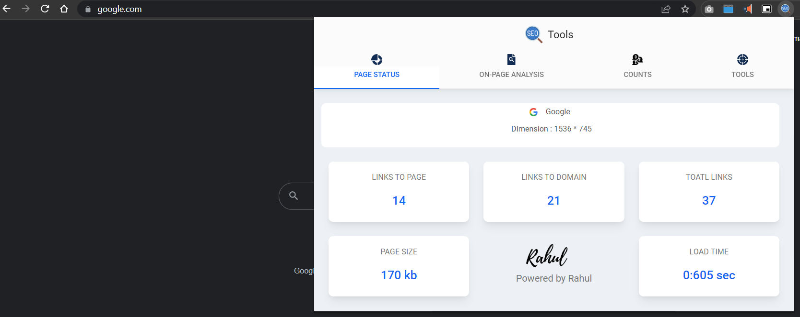
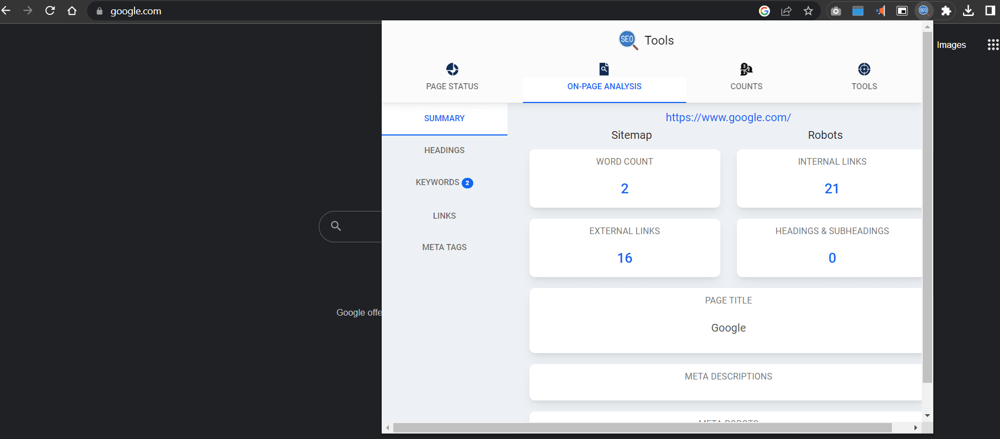
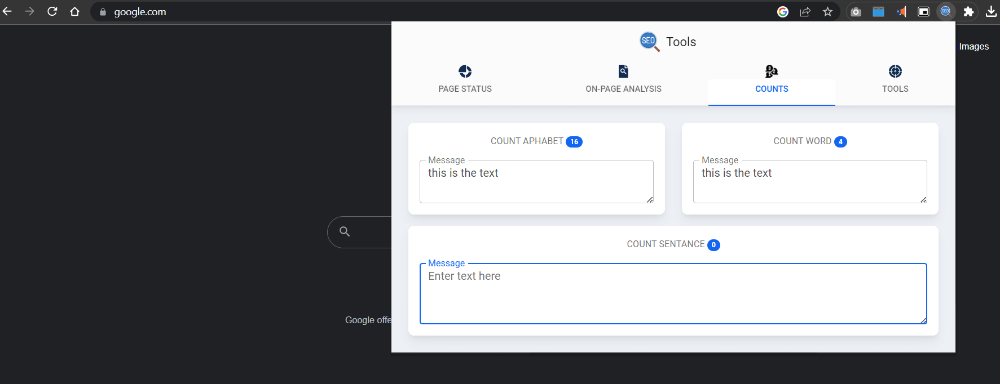
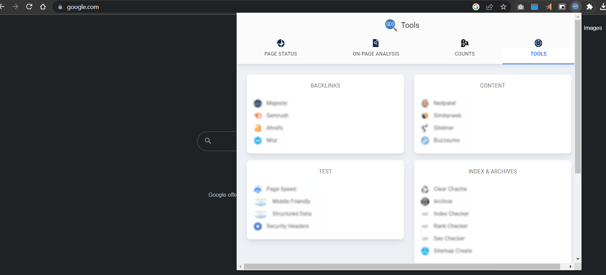

# SEO plugin
- **Get page status** - Title, favicon.ico and dimension, page load time and page size, link related to page, domain and total number of link
- **On-page Analysis** - *Summary* details have word count, internal link, external link, page title, discription and meta data of page
- **On-page Analysis** - *Heading section* contain all h1, h2, h3, h4, h5, h6 heading.
- **On-page Analysis** - *Keyword section* contain list of keyword used in web page and how many time used. You can download this in excel format.
- **On-page Analysis** - *Links section* contain all ancher, image, video, links, script link in diffrent tab. You can also download this in excel format.
- **On-page Analysis** - *Meta data* contain all meta tag values of web page.
- **Counts** - Section contain count alphabet, count ord, count sentance section.
- **Tools** - Section suggest you diffrent tools for backlink, content, test website, indexing and archives, optimization tools and analytic data tools

### Page status

### On-page Analysis

### Counts

### Tools

